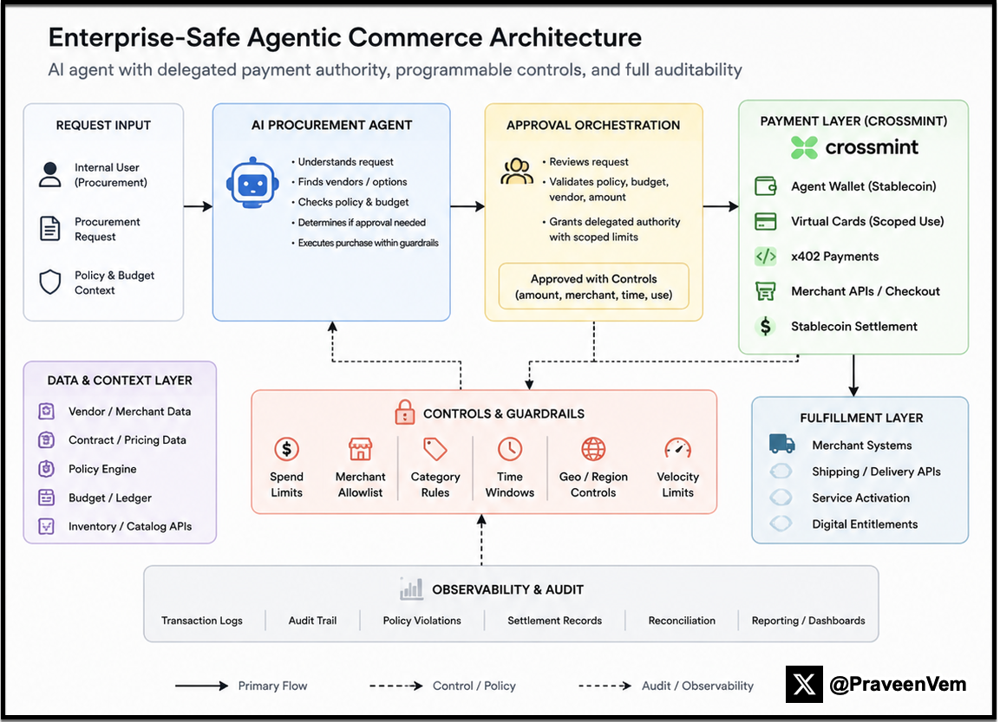
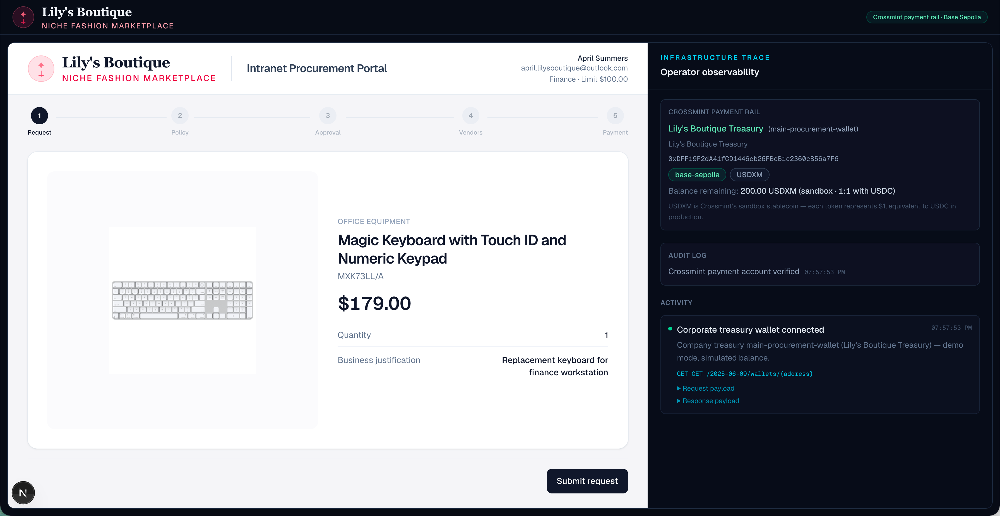
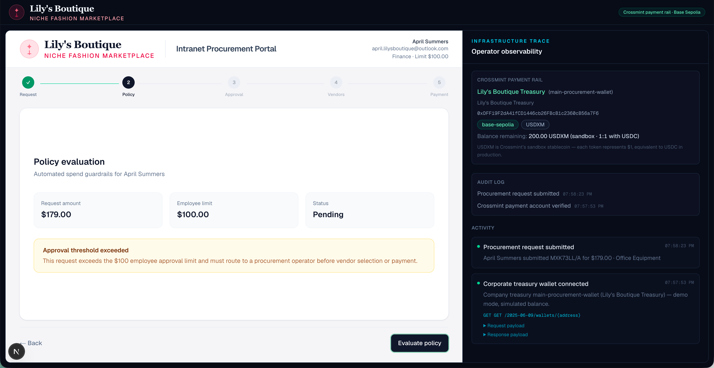
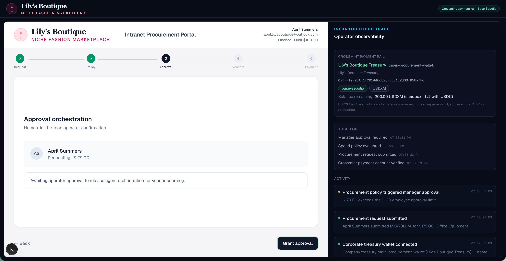
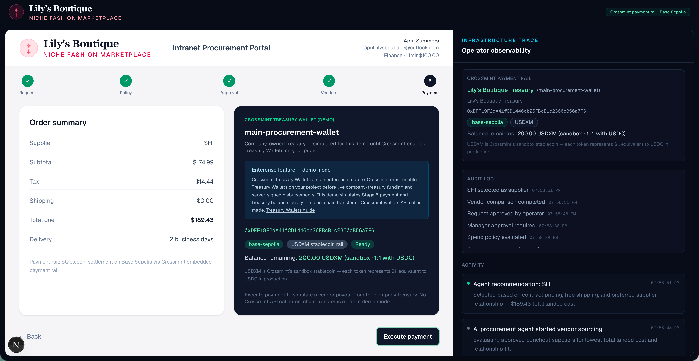

# Enterprise Agent Procurement

A prototype exploring how AI-native enterprise procurement workflows could use embedded programmable payment infrastructure.

---

## Overview

This project explores what enterprise-safe agentic commerce could look like in practice.

The demo simulates a procurement workflow inside Lily’s Boutique where:

1. An employee requests an Apple Magic Keyboard
2. Procurement policy evaluates spend thresholds
3. Manager approval is required because the amount exceeds employee limits
4. An AI procurement agent compares approved suppliers
5. Payment preparation occurs through an embedded programmable wallet layer
6. A treasury payout is simulated using stablecoin-ready infrastructure concepts

The goal was not to build a production procurement system, but to better understand how:

- AI agents
- programmable payment controls
- delegated authority
- approval orchestration
- embedded wallets
- stablecoin settlement
- auditability

could work together inside enterprise commerce systems.

---

## What is Real

The following parts of the demo are real and functional:

- Crossmint embedded wallet authentication
- Email OTP login flow
- Embedded EVM wallet provisioning
- Base Sepolia wallet integration
- Real Crossmint staging API keys
- Procurement workflow UI
- Stateful workflow orchestration
- Infrastructure observability panel
- Cursor-assisted development workflow

---

## What is Simulated

The following components are intentionally simulated:

- Vendor quote APIs
- Supplier punchout catalogs
- Vendor payout execution
- Stablecoin treasury disbursement
- Crossmint treasury wallet payout APIs

Crossmint Treasury Wallet payouts currently require enterprise enablement on the project account.

Because of that limitation, the final payment execution step is simulated and clearly labeled as demo-only.

No real on-chain stablecoin transfer occurs.

---

## Architecture



---

## Workflow Screens

### Procurement request



### Policy evaluation



### Approval orchestration



### Vendor comparison


### Payment preparation



---

## Technical Concepts Explored

### Embedded wallets

The demo uses Crossmint embedded wallets to abstract blockchain complexity away from end users.

The employee never interacts directly with:

- seed phrases
- MetaMask
- gas management
- blockchain UX

The wallet behaves as infrastructure underneath the procurement workflow.

---

### Delegated authority

The procurement operator grants scoped approval for:

- vendor sourcing
- transaction amount
- payment authorization

This models how AI agents may eventually operate within enterprise guardrails instead of operating autonomously without controls.

---

### Infrastructure observability

The right-side observability panel demonstrates:

- workflow audit events
- policy evaluation
- vendor selection
- simulated API traces
- simulated payout payloads

This reflects the type of operational visibility enterprise finance and risk teams would likely require.

---

## Tech Stack

- Next.js App Router
- TypeScript
- Tailwind CSS
- Crossmint React SDK
- Base Sepolia
- Cursor
- Vercel

---

## Local Development

### Install dependencies

```bash
npm install
```

### Create environment file

Create `.env.local`

```env
NEXT_PUBLIC_CROSSMINT_API_KEY=
CROSSMINT_SERVER_API_KEY=
NEXT_PUBLIC_CROSSMINT_CHAIN=base-sepolia
CROSSMINT_SIGNER_SECRET=
```

### Start development server

```bash
npm run dev
```

---

## Project Structure

```text
app/
components/
hooks/
lib/
providers/
public/screenshots/
```

---

## Screenshots Used

Recommended screenshot names:

```text
public/screenshots/architecture.png
public/screenshots/procurement-request.png
public/screenshots/policy-evaluation.png
public/screenshots/approval-orchestration.png
public/screenshots/vendor-comparison.png
public/screenshots/payment-preparation.png
```

---

## Why This Project Was Built

This prototype was built to explore how AI-driven agentic workflows could streamline enterprise procurement processes while operating within existing business guardrails.

The focus was less on any specific payment modality and more on how agentic systems could coordinate:

- procurement requests
- approval workflows
- vendor comparison
- payment preparation
- auditability
- delegated authority
- infrastructure orchestration

across enterprise systems.

One of the more important realizations from this work was that the financial infrastructure layer should largely disappear into the workflow itself.

Whether settlement ultimately occurs through stablecoins, fiat rails, virtual cards, ACH, or other payment mechanisms may become increasingly abstracted from the end-user procurement experience.

---

## ⚠️ Disclaimer

This project is based on personal work and is not affiliated with or supported by Visa.

The code is provided for educational purposes only and is not production-ready.

This is a learning prototype and architecture exploration.

It is not production software and does not execute real vendor payouts or stablecoin settlement.